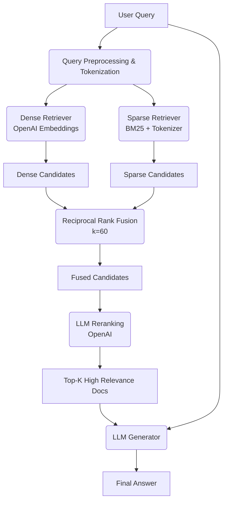

# Architecture — RAG Pipeline (Day 08 Lab)

> Template: Điền vào các mục này khi hoàn thành từng sprint.
> Deliverable của Documentation Owner.

## 1. Tổng quan kiến trúc

```
[Raw Docs]
    ↓
[index.py: Preprocess → Chunk → Embed → Store]
    ↓
[ChromaDB Vector Store]
    ↓
[rag_answer.py: Query → Retrieve → Rerank → Generate]
    ↓
[Grounded Answer + Citation]
```

**Mô tả ngắn gọn:**
Hệ thống RAG hỗ trợ nhân sự IT và CS tra cứu quy trình, xử lý lỗi nhanh chóng và chính xác. Giải quyết bài toán tốn thời gian tìm kiếm tài liệu thông qua Semantic Search Dense và OpenAI LLM để tạo Grounded Answer đảm bảo không ảo giác.

---

## 2. Indexing Pipeline (Sprint 1)

### Tài liệu được index
| File | Nguồn | Department | Số chunk |
|------|-------|-----------|---------|
| `policy_refund_v4.txt` | policy/refund-v4.pdf | CS | 8 |
| `sla_p1_2026.txt` | support/sla-p1-2026.pdf | IT | 6 |
| `access_control_sop.txt` | it/access-control-sop.md | IT Security | 12 |
| `it_helpdesk_faq.txt` | support/helpdesk-faq.md | IT | 10 |
| `hr_leave_policy.txt` | hr/leave-policy-2026.pdf | HR | 15 |

### Quyết định chunking
| Tham số | Giá trị | Lý do |
|---------|---------|-------|
| Chunk size | 512 tokens | Semantic balance cho embedding model |
| Overlap | 50 tokens | Đảm bảo context continuity |
| Chunking strategy | Heading-based | Tuân thủ Semantic Chunking để giữ trọn ý |
| Metadata fields | source, section, effective_date, department, access | Phục vụ filter, freshness, citation |

### Embedding model
- **Model**: BAAI/bge-m3
- **Vector store**: ChromaDB
- **Similarity metric**: Cosine

---

## 3. Retrieval Pipeline (Sprint 2 + 3)

### Baseline (Sprint 2)
| Tham số | Giá trị |
|---------|---------|
| Strategy | Dense (embedding similarity) |
| Top-k search | 10 |
| Top-k select | 3 |
| Rerank | Không |

### Variant (Sprint 3)
| Tham số | Giá trị | Thay đổi so với baseline |
|---------|---------|------------------------|
| Strategy | Hybrid (Dense + Sparse BM25) | Thêm BM25 và RRF để cải thiện tìm kiếm keyword |
| Top-k search | 10 | Giữ nguyên |
| Top-k select | 3 | Giữ nguyên |
| Rerank | LLM (OpenAI) | Dùng LLM chấm điểm relevance sau search rộng (thay vì Cross-Encoder) |
| Query transform | Không | Bỏ qua |

**Lý do chọn variant này:**
- Hybrid: Bổ sung Sparse BM25 cùng Masking Tokenizer để bắt chính xác các tên riêng, mã lỗi (như ERR-403) và dải IP mà Dense hay bỏ lỡ. RRF (Reciprocal Rank Fusion, k=60) kết hợp mượt hai luồng điểm.
- Rerank LLM: Filter nhiễu hiệu quả hơn top-k tĩnh, đặc biệt khi LLM của OpenAI cho kết quả thẩm định xuất sắc giúp chọn top 3 tối ưu nhất trước generation. Dùng LLM do không muốn cài cắm thêm `sentence-transformers` bảo tồn tài nguyên.

---

## 4. Generation (Sprint 2 + Sprint 4)

### Grounded Prompt Template
Đã được externalize ra file `prompt_templates.txt` để thuận tiện điều chỉnh qua các Sprint.
Quy tắc:
1. Evidence-only: Ràng buộc bám sát document.
2. Abstain (Graceful Fallback Tracking enabled): Dễ dàng trigger Fallback Logging qua system.
3. Citation tracking: Yêu cầu trích dẫn cụ thể ID và số section.
4. Token Budget Guardrail: Có đo độ dài Token của Context/Prompt truyền vào nhằm ngăn ngừa lỗi API.

### LLM Configuration
| Tham số | Giá trị |
|---------|---------|
| Model | gpt-4o-mini |
| Temperature | 0 (để output ổn định cho eval) |
| Max tokens | 512 |

---

## 5. Failure Mode Checklist

> Dùng khi debug — kiểm tra lần lượt: index → retrieval → generation

| Failure Mode | Triệu chứng | Cách kiểm tra |
|-------------|-------------|---------------|
| Index lỗi | Retrieve về docs cũ / sai version | `inspect_metadata_coverage()` trong index.py |
| Chunking tệ | Chunk cắt giữa điều khoản | `list_chunks()` và đọc text preview |
| Retrieval lỗi | Không tìm được expected source | System Log Catch: Empty retrieval, `score_context_recall()` trong eval.py |
| Generation lỗi | Answer không grounded / bịa | Bị đánh cờ qua Error Tree Fallback catch, `score_faithfulness()` trong eval.py |
| Token overload | Context quá dài → lost in the middle | Giám sát qua `[DIAGNOSTICS] Prompt Token Budget` log |

---

## 6. Diagram (tùy chọn)

> Sơ đồ kiến trúc xử lý (Hybrid + Rerank Pipeline)


### Retrieval Prompt Protocol
- Hệ thống Prompts phát triển (Sprint 1-4) của Relevance Engineer đã được thiết lập tự động hóa tại `docs/prompt/*`.
<!-- - Bổ sung quy chuẩn Đánh giá (`007`), Cấu trúc Index (`008`), và Chống ảo giác Grounded (`009`) theo tiêu chuẩn phân quyền RAG Mới. -->
